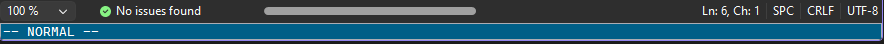
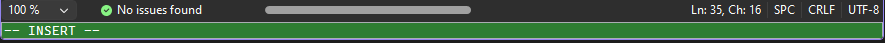

VsVimPlus
===
This is a personal fork of [VsVim](https://github.com/VsVim/VsVim), the free Vim
emulator for Visual Studio, originally created by Jared Parsons and maintained by
its contributors. All of the underlying Vim emulation here — modes, motions,
operators, registers, macros, and the rest — is VsVim's work, not this fork's. All
code remains under the Apache 2.0 license (`License.txt`), unmodified from upstream.

**Why this fork exists:** VsVim itself doesn't need to change to stay a faithful,
reliable Vim emulator. This fork is a place to experiment with extra
editor-experience features layered on top of it — things that are more about
"nice to have while editing in Visual Studio" than "core Vim emulation" — without
asking the upstream project to take on that scope or maintenance burden. Features
added here may or may not be proposed back upstream.

### Fork features

- **Mode-colored status bar** — the bottom command bar now changes color based on
  the current Vim mode (Normal, Insert, Visual, Replace, Command...), similar to
  Neovim statusline plugins. It's on by default; colors can be customized (or the
  feature turned off entirely) under `Tools > Options > VsVim > Mode Colors`.

   
- **System clipboard as the unnamed register** — optionally makes `y`/`d`/`p`/`P`
  (without an explicit register) read from and write to the Windows clipboard, so
  content copied outside Visual Studio can be pasted with `p`/`P`. Off by default;
  enable it under `Tools > Options > VsVim > VsVimPlus` ("Use System Clipboard as
  Unnamed Register").
- **Recent files picker** — a dark, fuzzy-searchable popup listing recently visited
  files, similar to Neovim's own recent-files navigation. Bind it the usual VS way
  (`Tools > Options > Keyboard`, search for `VsVimPlus.ShowRecentFiles`) or from a
  vimrc with `nnoremap <leader>fr :vsc VsVimPlus.ShowRecentFiles<CR>`. No settings
  toggle — it's just a command like any other Visual Studio command.

Fork-added settings that don't need a dedicated UI (like the clipboard option above)
live together under `Tools > Options > VsVim > VsVimPlus`, kept separate from
upstream VsVim's own `Defaults`/`Keyboard` pages so pulling in upstream changes
doesn't collide with them. Features needing richer UI (like Mode Colors) get their
own page instead.

### Removed from upstream

- **Visual Studio for Mac support** — upstream VsVim supported VS for Mac via a
  separate `VimMac` project. Since Visual Studio for Mac has been discontinued by
  Microsoft, that project and its CI job were removed here rather than carried
  forward as dead code. This fork targets Visual Studio on Windows only.

## Developing
VsVimPlus can be developed using Visual Studio 2022. The details of the 
development process can be found in
[Developing.md](https://github.com/HollowThorn/VsVimPlus/blob/master/Documentation/Developing.md)

When developing please follow the
[coding guidelines](https://github.com/HollowThorn/VsVimPlus/blob/master/Documentation/CodingGuidelines.md)

## License

All code in this project is covered under the Apache 2 license a copy of which 
is available in the same directory under the name License.txt.
